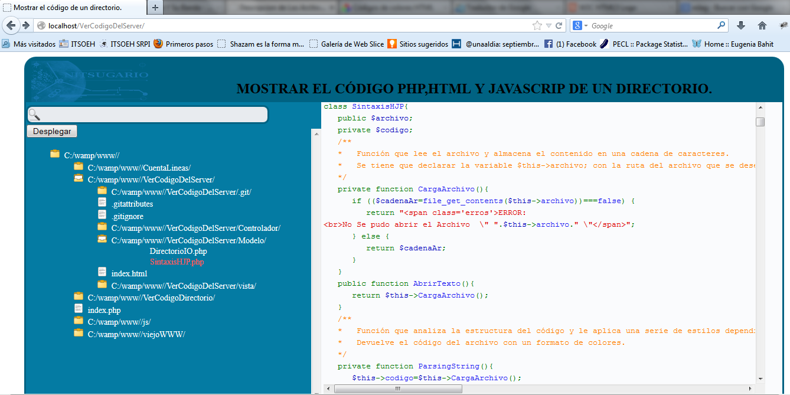
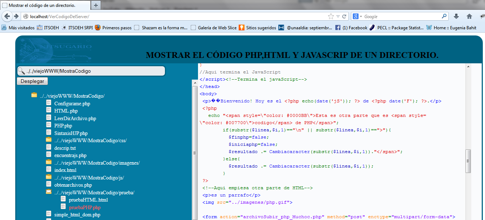
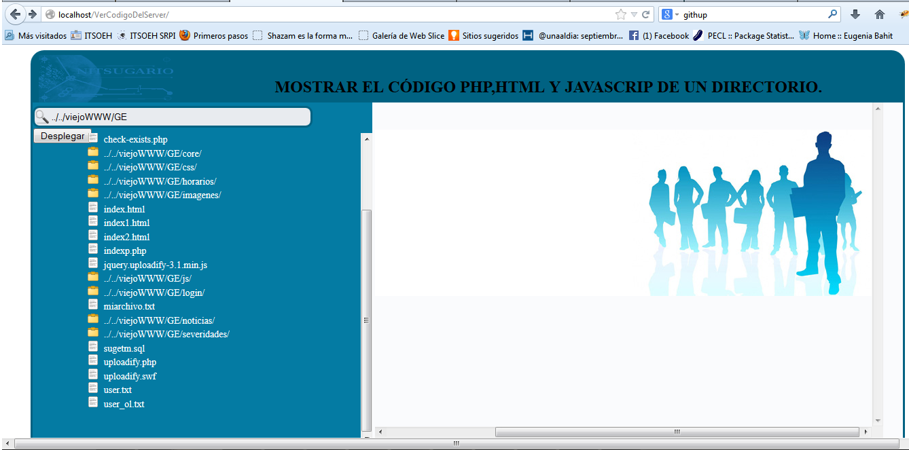

Explorador de directorios
==================

El explorador de directorios muestra el código de un archivo HTML, PHP y JavaScript con la sintaxis remarcada e imágenes de un directorio en el server.

This package can display and browse listing of files in directories.
It generates a Web based user interface to let the user browse the listing of files in directories and their sub-directories.
It can also display the contents of given files and highlight the code of PHP files, as well display image files.

La interfaz es capaz de:
==================

* Mostrar el árbol de un directorio indicado.
* Distingue entre documentos, carpetas y subcarpetas del directorio indicado.
* Es capaz de mostrar el código con la sintaxis remarcada del documento (HTML, PHP y JavaScript) seleccionado en el árbol del directorio.
* Puede Mostrar las imágenes  que estén en el directorio indicado.
* Se puede indicar el directorio que se desee.

El explorador hace uso de dos clases principales:
==================

* DirectorioIO.php : que permite el manejo del sistema de ficheros y el escaneo de los directorios.
* SintaxisHJP.php: permite el remarcado de sintaxis de los archivos HTML, PHP y JavaScript.

Examples
--------

Ejemplo de código php:

Ejemplo de código php, html y JavaScript:

Ejemplo de una imagen:

NOTA
==================

Esta es solo para ambientes de desarrollo, por ninguna razón lo implemente en ambientes de producción ya que implica un manejo directo al sistema de ficheros de su servidor.
